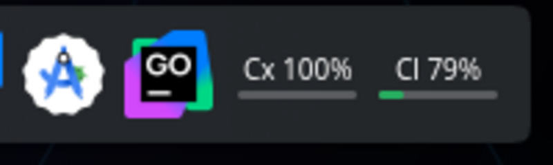
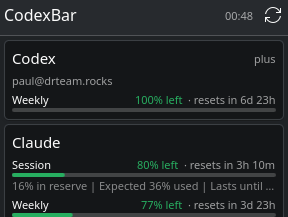
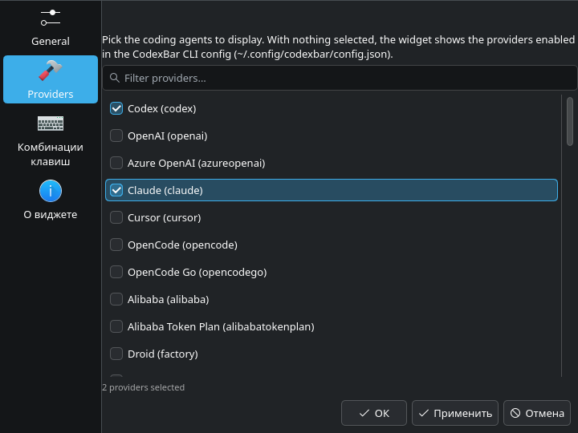

# CodexBar-KDE

KDE Plasma 6 widget (plasmoid) that shows AI coding-provider limits from the
[CodexBar](https://github.com/steipete/CodexBar) CLI: session/weekly usage bars,
reset countdowns, pace summaries, credits, and provider errors.

Works both on the desktop and in a panel:

| Panel (compact) | Popup / desktop | Settings |
| --- | --- | --- |
|  |  |  |

## Requirements

- KDE Plasma 6 (`kpackagetool6`)
- [CodexBar CLI](https://github.com/steipete/CodexBar/releases) for Linux on
  `PATH` (or anywhere — the path is configurable). Quick install:

  ```bash
  curl -sL -o /tmp/codexbar.tar.gz \
    "$(curl -sL https://api.github.com/repos/steipete/CodexBar/releases/latest \
       | grep -o '"browser_download_url": *"[^"]*linux-x86_64.tar.gz"' | cut -d'"' -f4)"
  mkdir -p ~/.local/bin && tar -xzf /tmp/codexbar.tar.gz -C ~/.local/bin CodexBarCLI \
    && ln -sf ~/.local/bin/CodexBarCLI ~/.local/bin/codexbar
  codexbar --version
  ```

- At least one provider signed in (Codex/Claude CLI credentials are picked up
  automatically; see `codexbar config providers` for the full list).

## Install

```bash
make install     # kpackagetool6 --type Plasma/Applet -i package
# or later:
make upgrade     # push code changes to the installed copy
```

Then add the **CodexBar** widget to a panel or the desktop
(right-click panel/desktop → *Add Widgets…* → search "CodexBar").

## Settings

- **General** — path to the `codexbar` binary, refresh interval, pace lines
  on/off.
- **Providers** — checkbox list of all 58 CodexBar providers. With nothing
  selected the widget follows the providers enabled in the CodexBar CLI config
  (`~/.config/codexbar/config.json`, managed via
  `codexbar config enable --provider <id>`). Selecting providers here fetches
  each one explicitly (`codexbar usage --provider <id>`), independent of the
  CLI config.

## How it works

The widget shells out to `codexbar usage --format json --no-color` through the
Plasma "executable" data engine on a timer, parses the JSON payloads in
[parser.js](package/contents/code/parser.js), and renders:

- **Compact (panel)**: per-provider badge (`Cx 100%` = percent left of the most
  used window) with a usage-colored mini bar (green/yellow/red at 70%/90% used).
- **Full (popup/desktop)**: one card per provider with usage bars per rate
  window (Session/Weekly/Monthly…), reset countdowns, pace summaries, account,
  plan, credits, status incidents, and error messages.

## Development

```bash
node --test           # unit tests for parser.js (no Qt required)
make install          # install the plasmoid
plasmawindowed org.rpa.codexbar   # run windowed for a quick look
```

`package/contents/code/parser.js` is engine-neutral: QML imports it directly
and Node tests `require()` it, so all parsing/formatting logic is unit-tested.

## License

MIT
